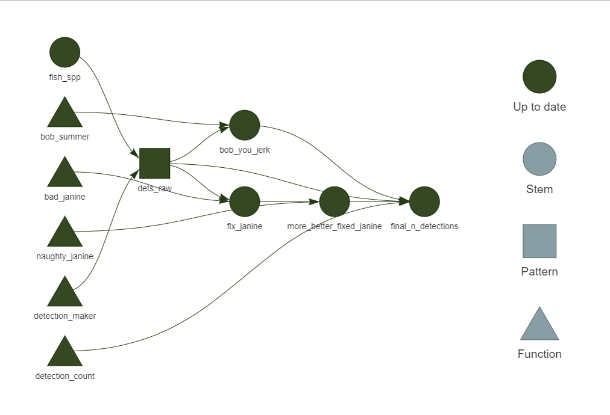
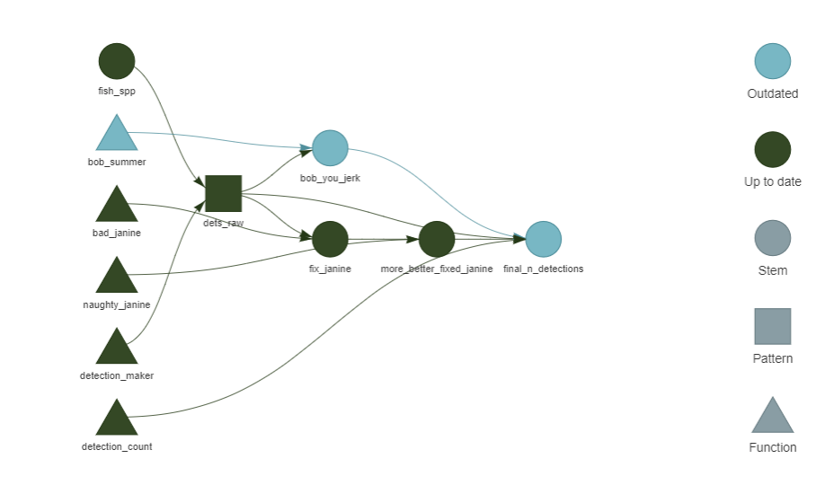

<!-- README.md is generated from README.Rmd. Please edit that file -->

# targets-n-telemetry

This is a quick-and-dirty example of how one might use a `targets`
workflow on telemetry data.

First, install `targets` and its companion package, `tarchetypes`.

``` r
install.packages(c('targets', 'tarchetypes'))
```

`targets` has a `usethis`-like function to set up some files that are
common in `targets` workflows. All of the helpful comments you see
within the files are created by that function, not by me!

``` r
library(targets)

use_targets()
```

The general idea to build out the workflow is that:

- you want to turn anything and everything into a function,
- you save the result of one function as a target,
- you use this target as the input to another function.

I prefer to keep my code in a directory called “code” (yes, I’m very
creative) which is sourced in the `_targets.R` file. Within the `code/`
directory, I group similar functions together in different R files.
These might be data import functions in `import.R` and visualization
functions in `visualizations.R`, or, in this case, functions to handle
different species separately in `speciesA.R`, `speciesB.R`, etc.

The first thing I want to do is make the dummy data. The input to this
data will be some ridiculous species names.

``` r
tar_target(fish_spp, c('jim', 'bo', 'bob', 'janine', 'nadine',
                       'vera', 'aloe_vera', 'vera_tasty'))
```

There is now a target called `fish_spp` that holds those species names.
Using those species names, I want to create dummy detection data. I’ll
call this `detection_maker` and have it live in a `.R` file of the same
name in `code/`.

``` r
detection_maker <- function(species, n_fish, n_dets, n_stations,
                            st_time, end_time){
  stations <- paste('station', 1:n_stations, sep = '-')
  fish <- paste(species, 1:n_fish, sep = '-')
  datetimes <- seq.POSIXt(st_time, end_time, by = 'sec')
  
  data.frame(
    id = sample(fish, n_dets, replace = TRUE),
    station = sample(stations, n_dets, replace = TRUE),
    datetime = sample(datetimes, n_dets, replace = FALSE)
  )
}
```

Now, we want the result of this to be a target, called, say, `dets_raw`.
We put this in the `_targets.R` file.

``` r
tar_target(
  dets_raw,
  detection_maker(fish_spp, 20, 100, 5,
                  as.POSIXct('2023-01-01 00:00:00'),
                  as.POSIXct('2023-05-15 12:00:00')),
  pattern = map(fish_spp)
)
```

Now, that new `pattern` argument means we’re getting fancy and using
“static branching”. The “static” part meaning that the inputs (species
names) will generally remain the same and the “branching” part meaning
that we’re going to apply our function to each part (“branch”) of the
input. If the function that created `fish_spp` changed every time the
workflow was run, we’d be using “dynamic branching”.

The `map` function is purposefully analogous to `purrr::map`, meaning
that you’re (ish) going to be looping through each member of `fish_spp`,
applying `detection_maker` to each one.

Super.

Now, species *Janine janinus* is badly behaved. It’s often detected at
Station \#4, even though we know that’s impossible (for whatever reason)
and it’s detected in January even though we tagged it in February.
You’ll want to create more-descriptive function names than this, but for
fun here we go:

``` r
bad_janine <- function(detections){
  janine <- detections[grepl('janine', detections$id),]
  
  janine[janine$station != 'station-4',]
}


# Also, we know everything in January is wrong
naughty_janine <- function(janine){
  janine[janine$datetime >= as.POSIXct('2023-02-01 00:00:00'),]
}
```

We could have combined them into the same function, say `clean_janine`,
but I just wanted to show how different functions start depending on
each other, which is when `targets` starts to shine.

And [what about Bob](https://www.imdb.com/title/tt0103241/)? Well, *Bob
bobus* only summers in Florida, so we’re going to drop non-summer
detections. I’ll put those functions in its own file:
`code/bob_funcs.R`.

``` r
bob_summer <- function(detections){
  bob <- detections[grepl('bob', detections$id),]
  
  bob[bob$datetime >= as.POSIXct('2023-06-01 00:00:00') &
        bob$datetime <= as.POSIXct('2023-09-01 00:00:00'),]
}
```

Lastly, we’ll have this all culminate by counting the total number of
detections. I’ll put that in *its* own file, `code/summarizer.R`.

``` r
detection_count <- function(raw_dets, janine_fixed, bob_fixed){
  rbind(
    raw_dets[!grepl('janine', raw_dets$id),],
    janine_fixed,
    bob_fixed
  ) |> 
    nrow()
}
```

The workflow is placed in a list in the `_targets.R` file.

``` r
list(
  tar_target(fish_spp, c('jim', 'bo', 'bob', 'janine', 'nadine',
                         'vera', 'aloe_vera', 'vera_tasty')),
  tar_target(
    dets_raw,
    detection_maker(fish_spp, 20, 100, 5,
                     as.POSIXct('2023-01-01 00:00:00'),
                     as.POSIXct('2023-05-15 12:00:00')),
    pattern = map(fish_spp)
  ),
  
  tar_target(
    fix_janine,
    bad_janine(dets_raw)
  ),
  
  tar_target(
    more_better_fixed_janine,
    naughty_janine(fix_janine)
  ),
  
  
  tar_target(
    bob_you_jerk,
    bob_summer(dets_raw)
  ),
  
  
  tar_target(
    final_n_detections,
    detection_count(dets_raw, more_better_fixed_janine, bob_you_jerk)
  )
)
```

Now, run the workflow! You can do this by sourcing the `run.R` file
created by `targets::use_targets()` or by typing `tar_make()` in your
console.

Now, take a look around.

- See what was made by running `tar_objects()`.
- Load a target directly by using `tar_load(bob_you_jerk)`
- Load a target to a different variable by using
  `clean_janine <- tar_read(more_better_fixed_janine)`

And, my personal favorite:

- visualize the whole shebang using `tar_visnetwork()`



## Updating

What happens if something changes? Imagine that we just received some
new data and now we know that *B. bobus* actually stays though October.
We can update the `bob_summer` function and take a look at what that
does to our workflow.

``` r
bob_summer <- function(detections){
  bob <- detections[grepl('bob', detections$id),]
  
  bob[bob$datetime >= as.POSIXct('2023-06-01 00:00:00') &
        bob$datetime <= as.POSIXct('2023-10-31 00:00:00'),]
}
```

``` r
tar_visnetwork()
```



Ah! It knows that `bob_summer` was changed, which has downstream effects
on `bob_you_jerk` and `final_n_detections`. If we run the workflow
again, *only those three targets will be re-run*.

    > targets::tar_make()
    ✔ skipped target fish_spp
    ✔ skipped branch dets_raw_82217696
    ✔ skipped branch dets_raw_4ded0305
    ✔ skipped branch dets_raw_be937cdf
    ✔ skipped branch dets_raw_9b4d0a56
    ✔ skipped branch dets_raw_1a7dc46f
    ✔ skipped branch dets_raw_a61920d7
    ✔ skipped branch dets_raw_ec6eb98a
    ✔ skipped branch dets_raw_d08f8e70
    ✔ skipped pattern dets_raw
    ✔ skipped target fix_janine
    ▶ dispatched target bob_you_jerk
    ● completed target bob_you_jerk [0.016 seconds]
    ✔ skipped target more_better_fixed_janine
    ✔ skipped target final_n_detections
    ▶ completed pipeline [0.25 seconds]

Not that big of a deal here, but you can imagine how much of a timesaver
this becomes as things get more complicated.
