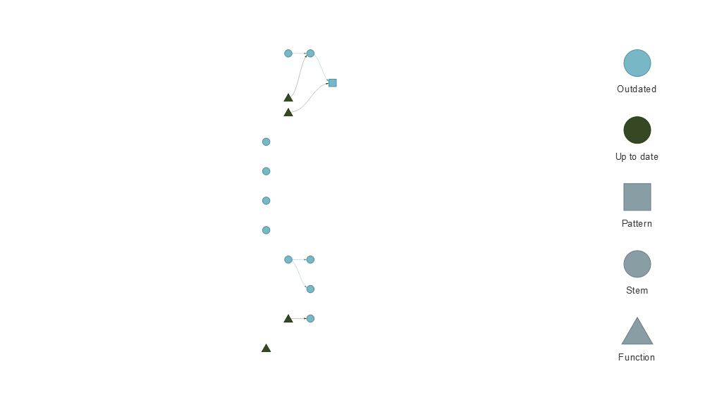

<!-- README.md is generated from README.Rmd. Please edit that file -->

# OTN Workshop targets

This branch is an exercise in converting the workflows outlined in the
living [OTN workshop
materials](https://ocean-tracking-network.github.io/otn-workshop-base/)
to [`targets`](https://docs.ropensci.org/targets/).

Pull requests are welcomed by anyone and everyone!

Completion:

- [x] Setup/Background
- [ ] Intro to R
  - [x] Setting up R
  - [x] Operators
  - [x] Functions
  - [ ] Vectors and Data Types
  - [ ] Indexing and Subsetting
  - [ ] Missing Data
- [ ] Starting with Data Frames
- [ ] Intro to Plotting
- [ ] Telemetry Reports - Imports
- [ ] Telemetry Reports for Array Operators
- [ ] Telemetry Reports for Tag Owners
- [ ] Introduction to glatos Data Processing Package
- [ ] More features of glatos
- [ ] Basic Visualization and Plotting
- [ ] Introduction to actel
- [ ] Preparing ACT/OTN/GLATOS Data for actel
- [ ] Basic Animation
- [ ] Animation with pathroutr
- [ ] Quality Control Checks with Remora
- [ ] Spatial and Temporal Modelling with GAMs
- [ ] Introduction to the miscYAPS package
- [ ] Introduction to Git for Code
- [ ] Other OTN Telemetry Curricula

Current network:

``` r
targets::tar_visnetwork()
```

<!-- -->
